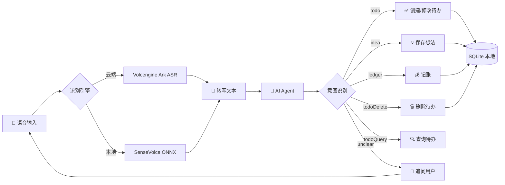

# 🎙️ Idea — 本地 AI 语音想法记录


---

## 🤔 你有没有这样的瞬间？

> 脑子里突然蹦出一个绝妙想法，掏出手机打字打了半天，灵感早飞了 😭

> 开车/走路/做饭的时候，突然想起来有个事要记，根本腾不出手 📱❌

> 备忘录里记了一堆碎片，乱七八糟找不到，最后直接摆烂 🤷

**这就是我写这个 App 的原因。**

---

## ✨ Idea —— 你的语音灵感捕手

一个**纯本地存储**、**AI 驱动**的语音想法记录 App。支持待办、想法、记账三大场景，用对话式 AI 帮你把碎片信息瞬间结构化。

**按住说话 → AI 理解 → 自动归档**，灵感再也不会溜走。

<div align="center">

### 🎬 一句话总结

**张嘴就记，AI 帮你整理，数据全在本地，谁也别想偷看 🔒**

</div>

---

## 🔥 核心功能

| 功能 | 说明 |
|---|---|
| 🎤 **语音录入** | 按住说话松手发送，AI 自动转文字，支持云端和本地两种识别引擎 |
| 🧠 **AI 结构化提取** | 自动识别意图类型（待办/想法/记账/删除/查询），标题、时间、地点、金额一键填好 |
| 🤖 **智能 Agent 对话** | 基于 Responses API 的完整 Agent 循环，支持工具调用、确认流程、上下文记忆 |
| 💰 **记账管理** | 自然语言记账 "午饭花了25元" → 自动分类、统计月收支 |
| 💬 **多轮对话补全** | 时间没说？地点没讲？AI 会追着你问，像小助理一样贴心 |
| ⚡ **流式 AI 回复** | 打字机效果实时出字，不用干等 |
| ⏰ **时间冲突检测** | 跟已有日程撞了？自动提醒，帮你处理冲突 |
| 🗑️ **语音删除** | "把明天的会议删了"——一句话搞定，不用翻列表 |
| 🔍 **全文搜索** | FTS5 索引加持，想法再多也秒搜 |
| 🔐 **数据全本地** | SQLite 本地存，API Key 加密存，隐私安全感满满 |
| 🌐 **端侧语音识别** | 集成 SenseVoice 本地模型，无网络也能语音转文字 |

---

## 🏗️ 技术栈



| 层级 | 技术选型 | 说明 |
|---|---|---|
| 🖼️ 框架 | **Flutter 3.x** | 一套代码跨端，Material 3 设计 |
| 🧩 状态管理 | **Riverpod** | 类型安全，依赖注入优雅，测试友好 |
| 🧭 路由 | **GoRouter** | 声明式路由，ShellRoute + 动画抽屉 |
| 🗄️ 数据库 | **Drift (SQLite)** | 类型安全 ORM，FTS5 全文搜索，12 张表 |
| 🔐 安全存储 | **Flutter Secure Storage** | Android Keystore 加密，Key 不过期 |
| 🎙️ 录音 | **record** | 纯 Dart 实现，WAV 格式，16kHz 单声道 |
| 🧠 端侧 ASR | **sherpa_onnx** | SenseVoice Small ONNX 模型，离线语音识别 |
| 🤖 AI | **火山引擎 Ark** / **DeepSeek** | Responses API + Chat API + Files API，多 Provider 可切换 |

---

## 📂 项目结构

```
Idea/
├── mobile_app/                         # Flutter 主工程
│   ├── lib/
│   │   ├── main.dart                   # 🚀 入口
│   │   └── src/
│   │       ├── app.dart                # MaterialApp + GoRouter + Push Drawer
│   │       ├── providers.dart          # Riverpod 依赖注入中枢
│   │       ├── data/                   # 🗄️ 数据层
│   │       │   ├── app_database.dart   # 12 张表 + 双 FTS5 索引
│   │       │   ├── tables.dart         # 表定义（Entries / Todos / Ideas / Ledger / Agent / Memory）
│   │       │   ├── entry_dao.dart      # DAO：CRUD + 分页 + 全文搜索
│   │       │   └── entry_repository.dart # 仓库层封装
│   │       ├── domain/                 # 🧠 领域层
│   │       │   ├── capture_models.dart           # Todo / Idea / Ledger / Delete / Query 模型
│   │       │   ├── capture_conversation_agent.dart # 多轮对话引擎
│   │       │   ├── capture_draft_merger.dart       # 草稿合并逻辑
│   │       │   └── conflict_detector.dart          # 时间冲突检测
│   │       ├── agent/                  # 🤖 Agent 系统
│   │       │   ├── agent_models.dart            # 类型定义（Tool / Event / Confirmation）
│   │       │   ├── agent_tool.dart              # 工具注册与分发
│   │       │   ├── agent_runtime.dart           # Agent 运行时（模型循环 + 工具调用）
│   │       │   ├── agent_session_controller.dart # 会话管理（Thread + Message 持久化）
│   │       │   ├── local_agent_tools.dart       # 本地工具实现（CRUD / 查询 / 记账）
│   │       │   └── memory_context_builder.dart   # 长期记忆（FTS5 检索 + 上下文注入）
│   │       ├── local_ai/               # 🧠 端侧 AI
│   │       │   ├── local_model_manager.dart     # 模型下载 / 校验 / 缓存
│   │       │   └── local_voice_runtime.dart     # SenseVoice 本地语音识别
│   │       ├── ai/                     # ☁️ AI 客户端
│   │       │   ├── volcengine_ark_capture_client.dart  # 火山引擎 Capture（流式 + 非流式）
│   │       │   └── ark_responses_agent_client.dart     # 火山引擎 Responses API（Agent 用）
│   │       ├── speech/                 # 🎙️ 语音服务
│   │       │   ├── volcengine_speech_service.dart     # 云端语音识别
│   │       │   └── volcengine_ark_files_client.dart    # Files API 上传
│   │       ├── features/               # 📱 UI 页面
│   │       │   ├── agent/agent_page.dart       # 智能记录（Agent 对话 + 语音输入）
│   │       │   ├── voice/voice_page.dart       # 语音记录（聊天式 Capture 交互）
│   │       │   ├── query/query_page.dart       # 待办列表 + 想法列表
│   │       │   ├── ledger/ledger_page.dart     # 记账（月视图 + 交易管理）
│   │       │   └── settings/settings_page.dart # 设置（API Key / 模型 / Provider 切换）
│   │       ├── settings/               # ⚙️ 加密配置存储
│   │       ├── audio/                  # 🔊 交互音效
│   │       └── widgets/                # 🧩 通用组件（Drawer / Header / InputBar）
│   ├── test/                           # ✅ 单元 & Widget 测试
│   └── docs/                           # 📋 规划文档
└── README.md                           # 你正在看这里！
```

---

## 🚀 快速开始

### 准备工作

- 安装 [Flutter SDK](https://flutter.dev) (>=3.x)
- 一台 Android 手机或模拟器
- 一个 [火山引擎 Ark](https://www.volcengine.com/product/ark) 的 API Key（或 DeepSeek API Key）

### 三步起飞

```powershell
# 1️⃣ 进入目录安装依赖
cd mobile_app
flutter pub get

# 2️⃣ 生成数据库代码
dart run build_runner build --delete-conflicting-outputs

# 3️⃣ 跑测试 + 打包
flutter test
flutter build apk --debug
```

> 💡 把 APK 装到手机上，在设置页填上你的 API Key 和 Base URL，就可以开始用啦！首次使用时需要在设置页下载端侧语音模型（SenseVoice + FSMN-VAD）。

---

## 🎨 设计亮点

- 🌈 **Material 3** 设计语言，暖色系主题（米白背景 `#f9f6ed` + 蓝色主色 `#3478e5`）
- 🎭 **按住录音 + 上滑取消**，手势交互丝滑
- 💬 **气泡式聊天界面**，AI 回复流式打字机效果
- 📊 **录音波形动画**，说话时波形跳动，视觉反馈拉满
- 🧵 **多轮对话记忆**，上下文不丢失，越聊越聪明
- 📱 **Push Drawer 导航**，带动画过渡的侧边抽屉，不遮挡内容

---

## 🗄️ 数据库设计

| 表名 | 说明 |
|---|---|
| `capture_sessions` | 会话记录（对话 + 草稿持久化） |
| `entries` | 条目主表（待办 / 想法） |
| `todos` | 待办扩展（时间 / 地点 / 主题 / 提醒） |
| `ideas` | 想法扩展（摘要 / 来源 / 收藏） |
| `tags` / `entry_tags` | 标签系统 |
| `ledger_transactions` | 记账流水（收支方向 / 金额 / 分类） |
| `agent_threads` | Agent 会话线程 |
| `agent_messages` | Agent 消息历史 |
| `agent_runs` | Agent 运行审计 |
| `agent_tool_calls` | 工具调用记录（含幂等 Key） |
| `agent_confirmations` | 待确认操作（过期自动失效） |
| `memory_items` | 长期记忆（FTS5 全文索引） |

---

## 🧪 测试覆盖

```
✅ app_database_test                — 数据库 CRUD + 迁移
✅ app_shell_test                   — 导航壳层 + Drawer
✅ capture_conversation_agent_test  — 多轮对话引擎
✅ capture_models_test              — 模型序列化
✅ conflict_detector_test           — 时间冲突检测
✅ idea_page_test                   — 想法列表
✅ todo_page_time_test              — 待办时间处理
✅ voice_page_stream_test           — 语音流式交互
✅ volcengine_ark_capture_stream_test — AI 流式解析
✅ ledger_page_test                 — 记账页面
✅ entry_repository_ledger_test     — 记账仓库层
✅ agent_page_test                  — Agent 页面
✅ agent_runtime_test               — Agent 运行时
✅ agent_session_controller_test    — 会话管理
✅ agent_tool_registry_test         — 工具注册
✅ agent_database_test              — Agent 数据持久化
✅ local_agent_tools_test           — 本地工具实现
✅ memory_context_builder_test      — 记忆构建
✅ ark_responses_agent_client_test  — Responses API 客户端
✅ interaction_sound_service_test   — 交互音效
✅ local_model_catalog_test         — 模型目录
✅ sensevoice_recognizer_config_test — 端侧识别配置
✅ rule_first_capture_router_test   — 规则优先路由
```

---

## 🗺️ 路线图

- [ ] 📬 本地通知提醒
- [ ] 🍎 iOS 适配
- [ ] 🌍 多语言支持
- [ ] 📤 数据导出（CSV / JSON）
- [ ] 🏷️ 标签管理系统
- [ ] 📊 记账统计图表（月度趋势 / 分类饼图）

---

## ⚠️ 注意事项

> 🔐 本项目为**个人使用**设计，没有中转服务器。语音数据可选择云端（火山引擎）或本地（SenseVoice ONNX）处理，API Key 加密存在手机安全存储里。数据库纯本地 SQLite，**谁也看不到你的数据**。

---

<div align="center">

### 🌟 好用的话，给个 Star 呗～

**灵感不等人，张嘴就记！** 🚀

---

*Made with ❤️ by Codex | Flutter + 豆包 AI + SenseVoice*

</div>
