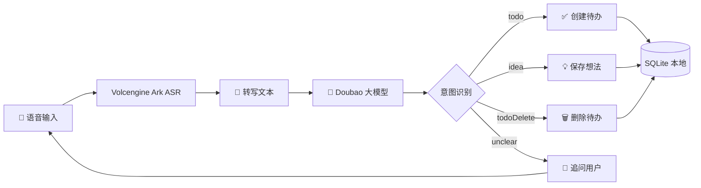

# 🎙️ 语音记想法？这个 App 真的太香了！！


---

## 🤔 你有没有这样的瞬间？

> 脑子里突然蹦出一个绝妙想法，掏出手机打字打了半天，灵感早飞了 😭

> 开车/走路/做饭的时候，突然想起来有个事要记，根本腾不出手 📱❌

> 备忘录里记了一堆碎片，乱七八糟找不到，最后直接摆烂 🤷

**谁懂啊！！这就是我写这个 App 的原因！！**

---

## ✨ Idea —— 你的语音灵感捕手

一个**纯本地存储**、**AI 驱动**的语音想法记录 App 🎯

**按住说话 → AI 理解 → 自动结构化存好**，整个过程行云流水，灵感再也不会溜走啦～

<div align="center">

### 🎬 一句话总结

**张嘴就记，AI 帮你整理，数据全在本地，谁也别想偷看 🔒**

</div>

---

## 🔥 核心功能，每一个都好用到爆

| 功能 | 有多香 |
|---|---|
| 🎤 **语音录入** | 按住说话松手发送，AI 自动转文字，再也不用手打 |
| 🧠 **AI 结构化提取** | 自动识别是"待办"还是"想法"，标题、时间、地点、标签一键填好 |
| 💬 **多轮对话补全** | 时间没说？地点没讲？AI 会追着你问，像小助理一样贴心 |
| ⚡ **流式 AI 回复** | 打字机效果实时出字，不用干等，体验拉满 |
| ⏰ **时间冲突检测** | 跟已有日程撞了？自动提醒，帮你处理冲突 |
| 🗑️ **语音删除** | "把明天的会议删了"——一句话搞定，不用翻列表 |
| 🔍 **全文搜索** | FTS5 索引加持，想法再多也秒搜 |
| 🔐 **数据全本地** | SQLite 本地存，API Key 加密存，隐私安全感满满 |
| 🌐 **离线兜底** | 没网也能用！本地规则引擎先顶上去 |

---

## 🏗️ 技术栈，开发者看过来



| 层级 | 技术选型 | 为什么选它 |
|---|---|---|
| 🖼️ 框架 | **Flutter 3.x** | 一套代码跨端，Material 3 设计好看 |
| 🧩 状态管理 | **Riverpod** | 类型安全，依赖注入优雅，测试友好 |
| 🧭 路由 | **GoRouter** | 声明式路由，深层链接支持 |
| 🗄️ 数据库 | **Drift (SQLite)** | 类型安全的 ORM，FTS5 全文搜索 |
| 🔐 安全存储 | **Flutter Secure Storage** | Android Keystore 加密，Key 不过期 |
| 🎙️ 录音 | **record** | 纯 Dart 实现，WAV 格式，16kHz 单声道 |
| 🤖 AI | **火山引擎 Ark** | 豆包大模型，Files API + Responses API + Chat API |

---

## 📂 项目结构，一目了然

```
Idea/
├── mobile_app/                    # Flutter 主工程
│   ├── lib/
│   │   ├── main.dart              # 🚀 入口
│   │   └── src/
│   │       ├── app.dart           # MaterialApp + GoRouter + Drawer
│   │       ├── providers.dart     # Riverpod 依赖注入中枢
│   │       ├── data/              # 🗄️ 数据层
│   │       │   ├── app_database.dart   # 6 张表 + FTS5 索引
│   │       │   ├── entry_dao.dart      # DAO：CRUD + 冲突查询
│   │       │   └── entry_repository.dart # 仓库层封装
│   │       ├── domain/            # 🧠 领域层
│   │       │   ├── capture_models.dart           # Todo / Idea / Delete 模型
│   │       │   ├── capture_conversation_agent.dart # 多轮对话引擎
│   │       │   ├── conflict_detector.dart          # 时间冲突检测
│   │       │   └── local_capture_heuristics.dart   # 离线正则兜底
│   │       ├── features/          # 📱 UI 页面
│   │       │   ├── voice/voice_page.dart    # 主录音页（聊天式交互）
│   │       │   ├── query/query_page.dart    # 待办 & 想法列表
│   │       │   └── settings/settings_page.dart # 设置页
│   │       ├── speech/            # 🎙️ 语音服务
│   │       ├── ai/                # 🤖 AI 客户端（流式 + 非流式）
│   │       ├── settings/          # ⚙️ 加密配置存储
│   │       └── widgets/           # 🧩 通用组件
│   ├── test/                      # ✅ 单元 & Widget 测试
│   └── plan/                      # 📋 规划文档
└── README.md                      # 你正在看这里！
```

---

## 🚀 快速跑起来

### 准备工作

- 安装 [Flutter SDK](https://flutter.dev) (>=3.x)
- 一台 Android 手机或模拟器
- 一个 [火山引擎 Ark](https://www.volcengine.com/product/ark) 的 API Key

### 三步起飞

```powershell
# 1️⃣ 进目录装依赖
cd mobile_app
flutter pub get

# 2️⃣ 生成数据库代码
dart run build_runner build --delete-conflicting-outputs

# 3️⃣ 跑测试 + 打包
flutter test
flutter build apk --debug
```

> 💡 把 APK 装到手机上，在设置页填上你的 Ark API Key，就可以开始用啦！

---

## 🎨 设计亮点

- 🌈 **Material 3** 设计语言，主题色 `#2f6df6`
- 🎭 **按住录音 + 上滑取消**，手势交互丝滑
- 💬 **气泡式聊天界面**，AI 回复流式打字机效果
- 📊 **录音波形动画**，说话时波形跳动，视觉反馈拉满
- 🧵 **多轮对话记忆**，上下文不丢失，越聊越聪明

---

## 🧪 测试覆盖

```
✅ app_database_test          — 数据库 CRUD
✅ app_shell_test             — 导航壳层
✅ capture_conversation_agent_test — 多轮对话引擎
✅ capture_models_test        — 模型序列化
✅ conflict_detector_test     — 时间冲突检测
✅ idea_page_test             — 想法列表
✅ local_capture_heuristics_test — 离线兜底规则
✅ todo_page_time_test        — 待办时间处理
✅ voice_page_stream_test     — 语音流式交互
✅ volcengine_ark_capture_stream_test — AI 流式解析
```

---

## 🗺️ 画饼中...

- [ ] 📬 本地通知提醒
- [ ] 🍎 iOS 适配
- [ ] 🌍 多语言支持
- [ ] 📤 数据导出
- [ ] 🏷️ 标签管理系统

---

## ⚠️ 注意事项

> 🔐 本项目为**个人使用**设计，没有中转服务器。你的语音数据直接发送到火山引擎做转录，API Key 加密存在手机本地安全存储里。数据库纯本地 SQLite，**谁也看不到你的数据**。

---

<div align="center">

### 🌟 好用的话，给个 Star 呗～

**灵感不等人，张嘴就记，冲！！** 🚀🎉

---

*Made with ❤️ by Codex | 用 Flutter + 豆包 AI 打造*

</div>
